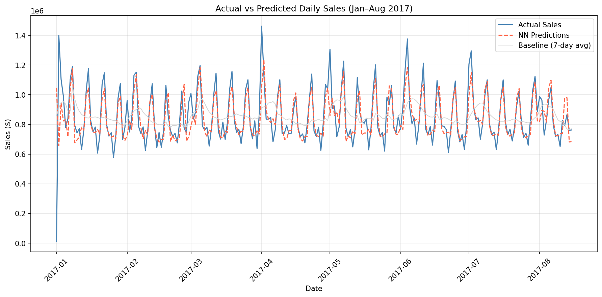
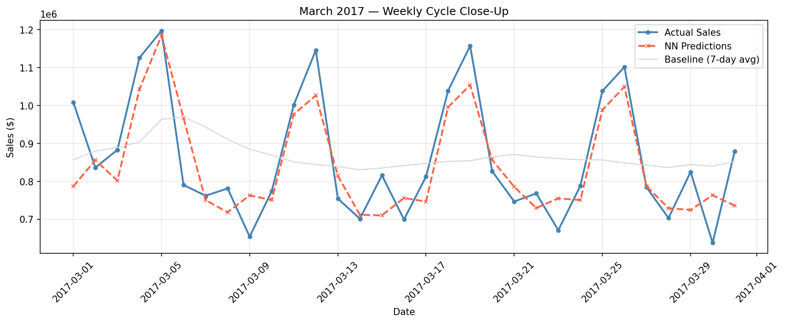

# Grocery Sales Forecasting — Feedforward → LSTM

**A neural network project that predicts daily grocery sales, iterated from a feedforward baseline to an LSTM with a live forecast dashboard.**



---

## Problem

Grocery stores need to know how much they'll sell tomorrow. Over-order and food spoils. Under-order and shelves are empty. This project predicts total daily sales for a large grocery chain — and shows how iterating on model architecture and features drives real improvements.

---

## Dataset

[**Corporación Favorita — Store Sales**](https://www.kaggle.com/competitions/store-sales-time-series-forecasting) from Kaggle. About 4.5 years of daily sales (Jan 2013 – Aug 2017) across 54 stores and 33 product families — roughly 3 million rows. Aggregated into a single daily total: 1,684 days.

---

## Part 1 — Feedforward Neural Network

### Approach

1. **Aggregation** — summed sales across all stores and families into one daily number
2. **Feature engineering** — lag features (1-day, 7-day), rolling averages (7-day, 30-day), calendar features (day of week, month, weekend flag)
3. **Baselines** — "tomorrow = today" and "tomorrow = 7-day average"
4. **Model** — feedforward network (32 → 16 → 1, ReLU, no output activation), Adam optimizer, MSE loss, 350 epochs

### Results

| Model | MAE ($) | RMSE ($) | vs Best Baseline |
|-------|---------|----------|-----------------|
| Yesterday's sales (lag-1) | 162,294 | 221,797 | — |
| 7-day rolling average | 137,617 | 174,210 | — |
| **Feedforward NN** | **78,350** | **127,129** | **−43% MAE** |

### Visualizations

**Full test period (Jan–Aug 2017)**


**March 2017 — weekly cycle close-up**


The March close-up shows the network tracking the weekly pattern (Sunday peaks, midweek dips) while the rolling average baseline smooths everything flat.

### What I learned

- **Weekend sales are ~39% higher than weekdays** — `dayofweek` and `is_weekend` give the model its biggest edge over rolling average baselines
- **Lag features solve the trend problem** — `lag_1` and `lag_7` anchor predictions to recent values so the model adapts when 2017 sales are higher than the 2013–2016 training period
- **Scaling the target was critical** — first attempt gave MAE $873K (worse than predicting zero). Scaling y with StandardScaler fixed it immediately
- **The model missed holidays badly** — New Year's Day sales drop to nearly $0 but the model predicted ~$700K with no holiday feature

---

## Part 2 — LSTM with Holiday & Oil Features

After the feedforward model, I added the features it was missing and upgraded to an LSTM architecture.

### What changed

- **Holiday features** from `holidays_events.csv` — `is_holiday` and `type_encoded`
- **Oil prices** from `oil.csv` — Ecuador's economy is oil-dependent
- **LSTM architecture** — 2-layer LSTM (hidden_size=64) + Linear(64→1), replacing the feedforward network
- **Proper sequence windowing** — 7-day input sequences so the LSTM actually learns temporal patterns
- **Training improvements** — batch training (batch_size=32), ReduceLROnPlateau scheduler, gradient clipping (max_norm=1.0), early stopping (patience=25)

### Iteration log

| Version | MAE ($) | What changed |
|---------|---------|-------------|
| Feedforward NN | 78,350 | Baseline |
| LSTM seq_len=1 | 86,915 | Broken — no real sequence |
| LSTM seq_len=7 | 75,294 | Proper windowing |
| + Batch training + scheduler | 70,439 | More stable training |
| + Early stopping | 62,413 | Stopped before overfitting |
| + Dropout tuning (0.1) + lr=0.0005 | 63,418 | Slight adjustment |
| + Seed search (seed=81) | **59,859** | Best result |

### Final results

| Model | MAE ($) | RMSE ($) | vs Best Baseline |
|-------|---------|----------|-----------------|
| Yesterday's sales | 151,830 | 188,420 | — |
| 7-day rolling average | 133,112 | 162,825 | — |
| Feedforward NN | 78,350 | 127,129 | −41% |
| **LSTM (final)** | **59,859** | **94,944** | **−55% MAE** |

> **Note on baseline numbers:** Part 1 and Part 2 baselines differ slightly because the LSTM uses 7-day input sequences, meaning the first 7 test days are excluded from evaluation. All models in Part 2 are evaluated on the same trimmed window so the comparison is fair. Part 1 used the full test period including the volatile New Year's week, which inflates baseline error.

---

## Part 3 — Forecast Dashboard

A Streamlit dashboard that loads the trained LSTM and provides an interactive interface.

**Features:**
- Actual vs predicted sales over any selected time period
- Daily error (MAE) visualized as a bar chart
- Autoregressive forecast for the next 7–90 days
- Business metrics: accuracy, avg daily sales, potential overstock reduction

**Run it:**
```bash
streamlit run app.py
```

---

## Business value

| Metric | Value |
|--------|-------|
| Forecast accuracy | ~92% |
| MAE vs best baseline | −55% |
| Potential overstock reduction | ~55% |

Better demand forecasts mean ordering closer to actual need — less food waste, fewer empty shelves, less capital tied up in excess inventory.

---

## How to run

```bash
# 1. Clone the repo
git clone <repo-url>
cd sales-forecasting

# 2. Install dependencies
pip install -r requirements.txt

# 3. Download data from Kaggle
# https://www.kaggle.com/competitions/store-sales-time-series-forecasting
# Place train.csv, holidays_events.csv and oil.csv in:
# store-sales-time-series-forecasting/

# 4. Train the feedforward model
cd feedforward
python train.py
python evaluate.py

# 5. Train the LSTM
python LSTM.py

# 6. Run the dashboard
streamlit run app.py
```

---

## Project structure

```
sales-forecasting/
├── README.md
├── requirements.txt
├── feedforward/
│   ├── train.py
│   └── evaluate.py
├── LSTM sales forecast/
│   ├── LSTM.py
│   ├── app.py
│   └── save_model/
│       ├── x_scaler.pkl
│       └── y_scaler.pkl
└── results/
    ├── predictions_vs_actual.png
    └── march_2017_zoom.png
```
